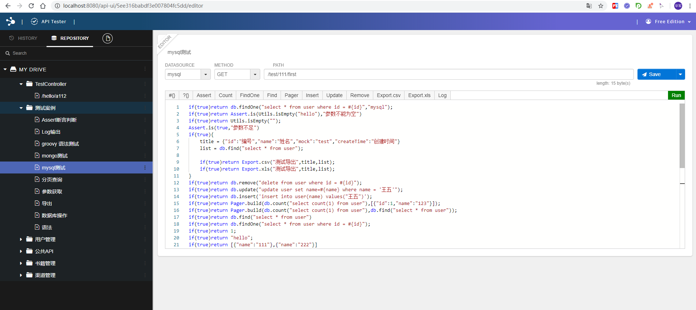

# dataway2

### 摘要
快速开发API接口，不再定义Controller,Service,Dao,Mybatis xml,Entity等对象。
实现原理，完全基于springboot2.x,快速集成。提供可视化界面，将入参封装到可执行的脚本上，脚本包含SQL语句，或者MONGODB查询语句，或者自定义扩展

### 特性
1. 支持SQL脚本查询     
2. 支持mongodb command脚本查询     
3. 支持单个查询        
4. 支持列表查询        
5. 支持分页查询        
6. 支持增删改操作       
7. 支持入参变量替换符：`#{}`,自动识别参数类型为`Integer`,`String`,`List`，分别替换为`1`,`'a'`,`1,'a'`
7. 支持变量作用域`pathVar(路径传参)`, `param(URL传参)`, `body(BODY JSON传参)`, `header(HEADER传参)`, `cookie(COOKIE传参)`
8. 支持判空逻辑 `#?{var,express}`,与`mybatis`中`if`标签 `if(var != null && var !=''){express}`等值 
9. 多数据源支持,继承自com.github.alenfive.dataway2.extend.DataSourceDialect       
10. 动态注册request mapping      
11. 支持自定义分页返回，默认对象：com.github.alenfive.dataway2.extend.DefaultApiPager       
12. 驼峰自动转换

### 快速开始
1/添加依赖
```$xml
<dependency>
    <groupId>com.github.alenfive</groupId>
    <artifactId>dataway2-boot-starter</artifactId>
    <version>0.0.1-SNAPSHOT</version>
</dependency>
```

版本查看: https://github.com/alenfive/dataway2/releases   

2/配置数据源,继承`com.github.alenfive.dataway2.extend.DataSourceManager` 注入数据源
```java
@Component
public class DefaultDataSourceManager extends DataSourceManager {

    @Autowired
    private JdbcTemplate jdbcTemplate;

    @PostConstruct
    public void init() {

        Map<String,DataSourceDialect> dialects = new HashMap<>();
        dialects.put("mysql",new MysqlDataSource(jdbcTemplate,true));
        super.setDialectMap(dialects);
    }
}
```

3/关系型数据库建表，非关系型不用
最新建表脚本查看: https://github.com/alenfive/dataway2/releases  

4/启动项目，访问地址: https://github.com/alenfive/dataway2/tree/master/src/main/resources/script




------------


### Document

### 目录：
1. <a href="#1">数据源配置</a>
2. <a href="#2">自定义分页实体</a>
3. <a href="#3">单个查询</a>
4. <a href="#4">列表查询</a>
5. <a href="#5">分页查询</a>
6. <a href="#6">更新/删除/修改</a>
7. <a href="#7">入参变量</a>
9. <a href="#8">变量作用域</a>

------------
#### <a name="1">1. 数据源配置</a>	

继承抽象类`com.github.alenfive.dataway2.extend.DataSourceManager` 如下：	
目前支持关系型数据库:`com.github.alenfive.dataway2.extend.MysqlDataSource`,非关系型数据库：`com.github.alenfive.dataway2.extend.MongoDataSource`,可通过抽象类：`com.github.alenfive.dataway2.extend.DataSourceDialect`进行扩展。	
`DataSourceDialect`的实现类中，其中成员变量:`storeApi` 有且只能有一个为`true`,表示API存储所在库
```java
@Component
public class DefaultDataSourceManager extends DataSourceManager {

    @Autowired
    private JdbcTemplate jdbcTemplate;

    @Autowired
    private MongoTemplate mongoTemplate;

    @PostConstruct
    public void init() {

        Map<String,DataSourceDialect> dialects = new HashMap<>();
        dialects.put("mysql",new MysqlDataSource(jdbcTemplate,false));
        dialects.put("mongodb",new MongoDataSource(mongoTemplate,true));
        super.setDialectMap(dialects);
    }
}
```
#### <a name="2">2. 自定义分页实体</a>
继承抽象类:`com.github.alenfive.dataway2.extend.ApiPagerInterface`,如下：
```java
@Component
public class DefaultApiPager implements ApiPagerInterface {
    @Override
    public Object buildPager(Long totalRecords, List data, ApiInfo apiInfo, ApiParams apiParams) {
        Map<String,Object> pager = new HashMap<>();
        pager.put("totalRecords",totalRecords);
        pager.put("data",data);
        return pager;
    }

    @Override
    public String getPageSizeVarName() {
        return "pageSize";
    }

    @Override
    public String getPageNoVarName() {
        return "pageNo";
    }

    @Override
    public String getIndexVarName() {
        return "index";
    }

    @Override
    public Integer getIndexVarValue(Integer pageSize,Integer pageNo) {
        return (pageNo-1)*pageSize;
    }

    @Override
    public Integer getPageSizeDefaultValue() {
        return 15;
    }

    @Override
    public Integer getPageNoDefaultValue() {
        return 1;
    }
}

```
#### <a name="3">3. 单个查询</a>
定义PATH如：`/book/first`,以`/first`结尾表示返回单个对象`{}`

#### <a name="4">4. 列表查询</a>
定义PATH如：`/book/list`,以`/list`结尾表示返回数组对象`[{}]`

#### <a name="5">5. 分页查询</a>
定义PATH如：`/book/page`,以`/page`结尾表示返回分页对象`{totalRecords:1,data:[{}]}`,由定义的<a href="#2">`ApiPagerInterface.buildPager`</a>决定

#### <a name="6">6. 更新/删除/修改</a>
非以上三种定义的URL，无返回值

#### <a name="7">7. 入参变量</a>
变量以`#{}`表示，与`mybatis`一致,如:
```
select * from book where id = #{id}
```
非必选参数，通过#?{var,express}表示,如:
```
select * from book where 1=1 #?{name,and name=#{name}}
```
与 mybatis `if(var != null && var !=''){and name = #{name}}` if标签写法等值

对象方式参数，通过`#{xx.xx}`表示,如:
```
select * from book where name = #{book.name} #{book.title,and title=#{book.title}}
```
数组对象参数，自动识别，如[1,2,'a']：
```$xslt
select * from book where id in (#{ids})
select * from book where id in (1,2,'a')
```

#### <a name="8">8. 变量作用域</a>
|  作用域 | 说明  |
| ------------ | ------------ |
|  `pathVar` |  URL路径传参,如`/book/{id}` |
|  `param` |  URL传参，如`/book?id=1` |
|  `body` |  BODY JSON格式传参，如`{"id":1}` |
|  `header` |  HEADER参数 |
|  `cookie` |  COOKIE参数 |

当指定了变量作用域，如:`#{pathVar.id}`时，会在指定的变量`pathVar`域中查询，无值会抛出异常`IllegalArgumentException`     
当不指定变量作用域时，如`#{id}`时，会按表格顺序从上到下依次去每个变量域中查询该变量，无值会抛出异常`IllegalArgumentException`

    